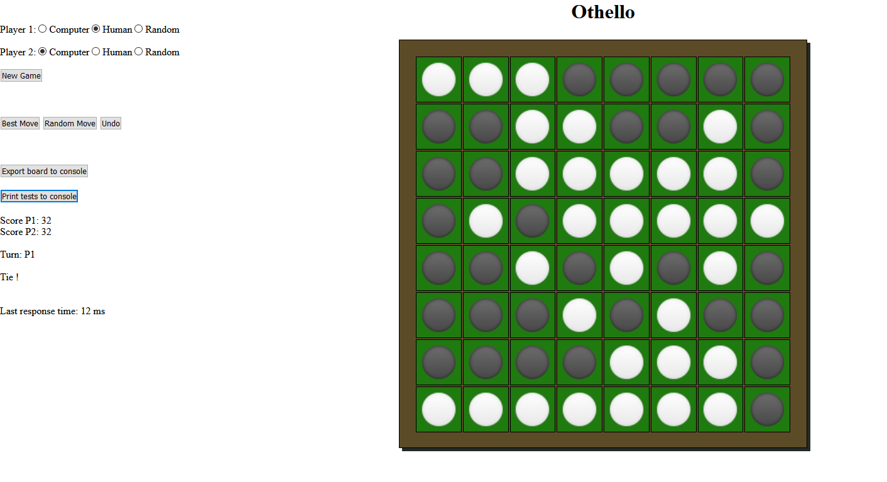

# Othello (PiS, SoSe 2020) 

Autor: Till Nitsche, 5197769

Ich habe die Zulassung für PiS im SoSe 2020 bei Herrn Herzberg erhalten.

# Inhaltsverzeichnis

<!-- vscode-markdown-toc -->
* 1. [Einleitung](#Einleitung)
	* 1.1. [Spielregeln](#Spielregeln)
	* 1.2. [Bedienungsanleitung](#Bedienungsanleitung)
	* 1.3. [Dateiübersicht](#Dateibersicht)
* 2. [Spiel-Engine (ENG)](#Spiel-EngineENG)
	* 2.1. [Allgemeines](#Allgemeines)
		* 2.1.1. [Konstruktor](#Konstruktor)
		* 2.1.2. [Bitboards](#Bitboards)
		* 2.1.3. [Darstellung](#Darstellung)
	* 2.2. [Hash-Map und Symmetrien](#Hash-MapundSymmetrien)
	* 2.3. [Alpha-Beta-Algorithmus](#Alpha-Beta-Algorithmus)
	* 2.4. [Heuristische Bewertungsfunktion](#HeuristischeBewertungsfunktion)
	* 2.5. [Eigene Datenbank](#EigeneDatenbank)
		* 2.5.1. [Auslesen](#Auslesen)
		* 2.5.2. [Einlesen](#Einlesen)
* 3. [Tests (TST)](#TestsTST)
* 4. [Umsetzung der GUI](#UmsetzungderGUI)
	* 4.1. [HTML](#HTML)
	* 4.2. [CSS](#CSS)
	* 4.3. [Javascript](#Javascript)
		* 4.3.1. [Kommunikation](#Kommunikation)
		* 4.3.2. [Automatische Züge](#AutomatischeZge)
		* 4.3.3. [Interaktion während automatischen Zügen](#InteraktionwhrendautomatischenZgen)
		* 4.3.4. [Zeitmessung](#Zeitmessung)
* 5. [Hinweise](#Hinweise)
* 6. [Quellennachweis](#Quellennachweis)

<!-- vscode-markdown-toc-config
	numbering=true
	autoSave=true
	/vscode-markdown-toc-config -->
<!-- /vscode-markdown-toc -->


## Einleitung

### Spielregeln

Das Spiel Othello (nah verwandt mit Reversi) ist ein Spiel für 2 Spieler. 
Ein neues Spiel wird immer mit zwei Spielsteinen beider Farben in der Mitte, diagonal über Kreuz, gestartet.
Gezogen wird abwechselnd. 
Der Spieler muss mit jedem Zug einen seiner Steine auf dem Spielfeld so platzieren, dass dieser mit einem anderen Stein seiner eigenen Farbe einen gegnerischen "einschließt". 
Damit werden alle eingeschlossenen Steine umgedreht und erhalten die Farbe des ziehenden Spielers. 
Das Ziel besteht darin möglichst viele Spielsteine seiner eigenen Farbe zum Ende eines Spiels auf dem Feld zu haben.
Falls ein Spieler keinen Zug durchführen kann, ist der Gegner an der Reihe.
Sobald es keine gültigen Züge für beide Spieler mehr gibt, endet das Spiel (das Feld muss also nicht zwingend mit Steinen gefüllt sein).

### Bedienungsanleitung



Nach dem Start mit `gradle run` öffnet sich automatisch der Standard-Browser mit der im Programm hinterlegten URL.
Falls dies nicht funktionieren sollte, kann die Oberfläche auch über `http://localhost:7070/` erreicht werden.

Das Spiel startet mit dem voreingestellten Start-Spielbrett. 
Die Spieleinstellungen sind standardmäßig mit einem menschlichen Spieler als Player1 und einem Computer-Spieler als Player2. 
Diese Einstellungen können zu jeder Zeit angepasst werden, auch mitten im Spiel.

Optionen für Player1 und Player2:
 * ``Computer``: Macht immer einen perfekten Zug
 * ``Human``: Lässt den Benutzer einen gültigen Zug machen
 * ``Random``: Führt einen zufälligen Zug durch
 
 Mit ``New Game`` wird mit gegebenen Einstellungen ein neues Spielbrett generiert. 
 Falls ein Spieler der Rolle `Human` am Zug ist, besteht die Möglichkeit eine dieser Aktionen durchzuführen:
 * ``Best Move``: Ein perfekter Zug wird durchgeführt
 * ``Random Move``: Ein zufälliger Zug wird durchgeführt
 * ``Undo``: Ein Zug wird rückgängig gemacht

Die erforderlichen Tests für dieses Projekt können durch ``Print tests to console`` in der Konsole ausgegeben werden.

Bei der Durchführung von Tests der Game-Engine kann man sich das aktuell im Browser dargestellte Spielbrett mit `Export board to console` exportieren, um relativ einfach innerhalb der Anwendung eine Instanz dieses Spielfeldes erzeugen zu können.
Der String ist ein Triple-Objekt, wird in der Konsole ausgegeben und kann in der Testklasse eingefügt werden (näheres im Abschnitt TST).
<br />
<br />

### Dateiübersicht

    \build.gradle
    \README.md
    \screenshot.png
    \src\main\kotlin\othello\App.kt
    \src\main\kotlin\othello\Othello.kt
    \src\main\kotlin\othello\OthelloGame.kt
    \src\main\kotlin\othello\Test.kt
    \src\main\resources\db.txt
    \src\main\resources\public\black-circle.png
    \src\main\resources\public\white-circle.png
    \src\main\resources\public\index.html
    \src\main\resources\public\style.css
    \src\main\resources\public\script.js

    -------------------------------------------------------------------------------
    Language                     files          blank        comment           code
    -------------------------------------------------------------------------------
    Kotlin                           4            139             51            389
    HTML                             1              9              3            134
    CSS                              1              4              0             67
    JavaScript                       1             15             11             35
    -------------------------------------------------------------------------------
    SUM:                             7            167             65            625
    -------------------------------------------------------------------------------
    
<br />
<br />
<br />
<br />

## Spiel-Engine (ENG)

Feature    | AB  | H+S | K  |  eD  | B+I+Im | Summe
-----------|-----|-----|-----|-----|------|----
Umsetzung  | 120 | 100 |  40 | 130 |  100 |
Gewichtung | 0.4 | 0.3 | 0.3 | 0.3 |  0.3 | 
Ergebnis   |  48 |  30 |  12 |  39 |   30 | **159%**

<br />
<br />

### Allgemeines
Die Spiel-Engine befindet sich in der Datei ``Othello.kt``.
Dort befindet sich ``class Othello``, die das Interface `OthelloGame` implementiert.
In dieser Implementierung ist eine Spielsituation niemals mutabel.
Stattdessen wird mit jedem Spielzug eine neue Othello-Instanz erzeugt (Immutabilität).

<br />

#### Konstruktor

```kotlin
class Othello (
        private val players: List<Long> = listOf(34628173824L, 68853694464L),
        private val turn: Int = +1,
        private val prevOthello: Othello? = null)
    : OthelloGame
```

Im Konstruktor der Klasse wird das Bitboard, bestehend aus zwei ``Long``-Werten,
der aktuell ziehende Spieler als ``Int`` (+1 für Spieler1, -1 für Spieler2) und die
eventuell vorhandene vorherige Spielsituation als ``Othello`` übergeben. 
Um einfach ein neues Spielbrett erzeugen zu können, befinden sich die Standard-Werte
bereits im Konstruktor.

<br />

#### Bitboards
Das komplette Spiel wird mithilfe von Bitboards dargestellt. 
Dieses ist auf diese Weise codiert:

```
| 0  | 1  | 2  | 3  | 4  | 5  | 6  | 7  |
| 8  | 9  | 10 | 11 | 12 | 13 | 14 | 15 |
| 16 | 17 | 18 | 19 | 20 | 21 | 22 | 23 |
| 24 | 25 | 26 | 27 | 28 | 29 | 30 | 31 |
| 32 | 33 | 34 | 35 | 36 | 37 | 38 | 39 |
| 40 | 41 | 42 | 43 | 44 | 45 | 46 | 47 |
| 48 | 49 | 50 | 51 | 52 | 53 | 54 | 55 |
| 56 | 57 | 58 | 59 | 60 | 61 | 62 | 63 |
```

Mit den Bitboards von beiden Spielern wird durchgehend in mehreren Methoden gearbeitet.
Jeder Spieler besitzt sein eigenes Bitboard, um alle Informationen darstellen zu können.
Wenn es um die Belegung einer bestimmten Position auf dem Spielfeld geht, kann man
sich an den folgenden Lambda-Expressions bedienen 
(liefern jeweils einen Boolean-Wert mit der Antwort, ob ein Feld besetzt ist).

```kotlin
private val currentPos = { pos: Int -> players[(-turn + 1).sign] and (1L shl pos) != 0L}
private val otherPos = {pos: Int -> players[(turn + 1).sign] and (1L shl pos) != 0L}
```

<br />

#### Darstellung
Um einen Überblick zu erhalten, wie eine aktuelle Spielsituation aussieht,
kann man sich das Feld auf der Konsole ausgeben lassen. Das geschieht mithilfe der
``toString()``.

Für die Darstellung im Browser hingegen wird in der Methode ``htmlResponse()``
eine neue HTML-Tabelle als String zusammengebaut.
Dieser String kann dann ganz einfach über Javalin weitergeleitet werden.
Die Verwendung wird im [Abschnitt GUI](#umsetzung-der-gui) erklärt.

<br />
<br />
<br />
<br />

###Hash-Map und Symmetrien
Um Bewertungen für eine Spielsituation nicht immer von neu berechnen zu müssen, 
wird eine HashMap verwendet. Diese wird statisch in ``class Othello`` 
unter den ``companion objects`` gespeichert. Mit Inhalt gefüllt wird diese 
zum einen durch den Alpha-Beta-Algorithmus, als auch beim Start der Anwendung,
durch das Auslesen der Datenbank mit Stellungsbewertungen.

Die HashMap wird folgendermaßen abgespeichert:
```kotlin
val results = hashMapOf<Othello, Int>()
```

Die Datenstruktur ist mutabel und lässt sich daher sehr gut um neue Einträge erweitern.
Da es sich bei dem Key um einen nicht-primitiven Datentyp handelt, muss entsprechend
die Methode ``equals()`` angepasst werden. Zwei Instanzen von `Othello` sollen genau dann
gleich sein, wenn der **Hashwert**  der beiden Bitboards miteinander übereinstimmen.

```kotlin
override fun equals(other: Any?): Boolean {
    if (this === other) return true
    if (other !is Othello) return false
    return other.hashValPlayer1() == this.hashValPlayer1() && other.hashValPlayer2() == this.hashValPlayer2()
}
```

Der **Hashwert** eines Bitboards ist der *kleinste* Wert aus allen Rotationen
und Spiegelungen eines Bitboards und wird durch ``hashVal(player: Long)`` generiert.
Damit wird stets garantiert, dass faktisch 
identische Spielstellungen nur einmal abgespeichert werden.

Die Rotationen/Spiegelungen geschehen mithilfe von eigens implementierten
logischen Binäroperationen. Dort befinden sich auch Magic-Numbers, die für
schnelle ``and`` Operationen gemacht worden sind.
Eine genauere Erklärung würde hier den Rahmen sprengen, 
darum verweise ich in diesem Fall einfach auf die [verwendete Quelle](https://www.chessprogramming.org/Flipping_Mirroring_and_Rotating).


<br />
<br />
<br />
<br />

### Alpha-Beta-Algorithmus
Für diese Implementierung wurde ein Alpha-Beta-Algorithmus mit
der Erweiterung um eine **Negamax-Variante** _und_ einer **Zugsortierung** 
nach [dieser Vorlage](https://de.wikipedia.org/wiki/Alpha-Beta-Suche) benutzt.

Durch eine Zugsortierung werden zuerst vielversprechende Züge betrachtet,
die wahrscheinlich einen früheren Cut-Off für den Alpha-Beta bedeuten.
Sortiert werden die Züge nach den Bewertungen der Positionen (siehe [Heuristische Bewertungsfunktion](#heuristische-bewertungsfunktione)).

Eine Besonderheit in dieser speziellen Umsetzung liegt darin, dass es einen wichtigen
Seiteneffekt gibt. Sobald eine neue Bewertung für eine Spielsituation (/Knoten) feststeht,
wird diese umgehend in der statisch zur Klasse zugeordneten HashMap abgespeichert.
 

<details>
    <summary>Durch den Negamax entstand eine sehr knappe Funktion:</summary>
    
```kotlin
    fun alphaBeta(depth: Int = DEPTH, alpha: Int = -Int.MAX_VALUE, beta: Int = Int.MAX_VALUE): Int {

        //look up the table if there is a key with the current setup
        if(results[this] != null)
            return results[this]!! * depth

        //maybe there is a result with a swapped key... invert it then
        if(results[swappedBoard()] != null)
            return results[this]!! * depth * -1

        if(isGameOver())
            return result() * depth * 1000 * -turn

        if(!isMoveAvailable())
            return -switchTurns().alphaBeta(depth, -beta, -alpha)

        if(depth == 0)
            return dynamicHeuristic() * depth * -turn

        val bestScore = run {
            listMoves().fold(alpha) {
                bestScore, move ->
                val score = -move.alphaBeta(depth - 1, -beta, -bestScore)
                if(bestScore in beta until score)
                    return@run bestScore
                return@fold max(bestScore, score)
            }
        }

        results[this] = bestScore
        //database.appendText("$players;$bestScore\n") //uncomment to save much more results to the database
        return bestScore
    }
```
</details>

Der Ablauf des Algorithmus:
1. Gibt es schon einen Eintrag in der HashMap? ⇒  ``return Ergebnis``
2. Ist ein Endknoten erreicht? ⇒ ``return if(Gewinn für aktuellen Spieler) 1000 else -1000``
3. Ist kein Spielzug mehr möglich? ⇒ ``return Ergebnis des alphaBeta mit Zugwechsel``
4. Ist die maximal eingestellte Tiefe erreicht? ⇒ ``return Heuristische Bewertung``
5. Suche die höchste Bewertung aus den nächsten Kindknoten durch Rekursion
6. Speichere die beste Bewertung in der HashMap
7. (optional) Speichere den Zug mit der Bewertung in der Datenbank
8. ``return Beste Bewertung``


<br />
<br />
<br />
<br />

### Heuristische Bewertungsfunktion
Zu Beginn des Projektes war noch der Plan eine Monte-Carlo-Simulation als Bewertung
zu implementieren. Diese Idee musste leider in einer späten Phase verworfen werden,
da die Laufzeitergebnisse sehr schlechte Ergebnisse lieferten.
Darum wird in dieser Implementierung eine heuristische Funktion als Stellungsbewertung verwendet.

Da es bereits viele Personen gab, die sich um eine geeignete Bewertung viele Gedanken gemacht haben,
habe ich mich dazu entschlossen [eine davon zu übernehmen](https://github.com/kartikkukreja/blog-codes/blob/master/src/Heuristic%20Function%20for%20Reversi%20(Othello).cpp).

Um eine Spielstellung mitten im Spiel zu bewerten, reicht es nicht aus die Differenz
der Spielsteine als Bewertung zu nehmen. Ein hoher Anteil an eigenen Steinen kann
sogar schlecht für den Spieler sein. Deshalb werden auch andere Aspekte betrachtet:

* **Eckfelder**: Die vier Felder in den Ecken sind viel wert, da sie für den Rest des
  Spiels nicht mehr umgedreht werden können und zusätzlich viele eigene Zugmöglichkeiten
  ergeben.

* **Mobilität**: Wie bei vielen anderen Brettspielen, ist es wichtig, die Mobilität
  des Gegners möglichst einzuschränken. Darum erhalten Züge, die viele weitere Folgezüge
  ermöglichen eine hohe Bewertung.
  
* **Spielstein-Parität**: Die Differenz an Spielsteinen wird bewertet,
    allerdings mit einer vergleichsweise geringen Gewichtung.
    
* **Stabilität**: Bestimmte Felder sind stabiler als andere (wie z.B. die Eckfelder), aber auch
  Felder an der Spielfeldkante entlang. Andererseits gibt es auch sehr schlechte Felder,
  wie die angrenzenden an den Ecksteinen, da diese für den Gegner eine hoch bewertete Position ermöglichen.
  Dadurch werden verschiedene Positionen, die im
  Besitz des ziehenden Spielers sind, unterschiedlich bewertet. 
  
  <br />
  
| 20  | \-3 | 11  | 8   | 8   | 11  | \-3 | 20  |
|:---:|:---:|:---:|:---:|:---:|:---:|:---:|:---:|
| \-3 | \-7 | \-4 | 1   | 1   | \-4 | \-7 | \-3 |
| 11  | \-4 | 2   | 2   | 2   | 2   | \-4 | 11  |
| 8   | 1   | 2   | \-3 | \-3 | 2   | 1   | 8   |
| 8   | 1   | 2   | \-3 | \-3 | 2   | 1   | 8   |
| 11  | \-4 | 2   | 2   | 2   | 2   | \-4 | 11  |
| \-3 | \-7 | \-4 | 1   | 1   | \-4 | \-7 | \-3 |
| 20  | \-3 | 11  | 8   | 8   | 11  | \-3 | 20  |

_Positionsbewertungen nach [dieser Implementierung](https://github.com/kartikkukreja/blog-codes/blob/master/src/Heuristic%20Function%20for%20Reversi%20(Othello).cpp)_


<br />
<br />
<br />
<br />

### Eigene Datenbank
Um Spielstellungen nicht nur flüchtig zu speichern, wurde eine Datenbank implementiert.
Diese befindet sich unter ``src/main/resources/db.txt``.

#### Auslesen
Um alle gespeicherten Informationen auszulesen, wird im ``init{ }`` 
des ``companion object`` einmal jede Zeile ausgelesen, geparst und in der
HashMap abgespeichert.

Die Datensätze sehen wie folgt aus:
``[34561328128, 68989485056];0``

Das entspricht: ``[BitboardP1, BitboardP2];Bewertung``

#### Einlesen
Um die Datenbank zu füllen, kann man einfach die folgende Zeile 
in der Methode ``alphaBeta()`` aus der Datei ``Othello.kt`` einkommentieren:

```kotlin
database.appendText("$players;$bestScore\n")
```

Damit werden weitere neue Einträge an das Ende des Dokumentes angefügt.
Nur sollte man damit aufpassen, da sehr schnell große Datenmengen anfallen.

<br />
<br />
<br />
<br />

## Tests (TST)

Szenario |  1  |  2  |  3  |  4  |  5  | Summe
---------|-----|-----|-----|-----|-----|-------
ok       |  X  |  X  |  X  |  X  |  -  | 0.8

Die Tests werden wie folgt ausgeführt:

Die Tests werden durch eine Request durch den Client im Browser ausgelöst. Dazu muss der Button ``Print tests to console`` angeklickt werden. 
Danach erscheinen die unten aufgeführten Tests auch in der Konsolenanwendung.

Um verschiedene Testszenarien zu simulieren, können die ``scenarios`` in der Klasse `Test.kt` angepasst werden.
Dort lassen sich im Kopf der Datei für die Szenarien Triple-Objekte, bestehend aus den Bitboards für Spieler 1, Spieler 2 und ziehendem Spieler (1/-1) anpassen.
Da diese sehr unleserlich sind und nur sehr mühsam nachzubilden sind, gibt es die Möglichkeit sich in der GUI passende Triple-Objekte für dargestellte Spielbretter ausgeben zu lassen.
Damit kann das folgende Programm sehr einfach Instanzen der verschiedenen Spielsituationen erzeugen. 

Anleitung zum Generieren eigener Testszenarien:
 1. Beliebige Spielsituation im Browser erzeugen
 2. Button ``Export board to console`` drücken
 3. Code-Snippet des Triple-Objekts kopieren
 4. In beliebiges Testszenario (`scenario1` - `scenario5`) einfügen
 5. Programm neu kompilieren und Testergebnis per GUI in der Konsole ausgeben lassen!

<br />
<br />

Die Testausführung protokolliert sich über die Konsole wie folgt:
    
<details>
 <summary>Alle Tests anzeigen</summary>
 
     ----------- TEST MODE START -----------------------------------------------------------------------------------------
     
     Player1 = X                  Player2 = O
     
     
     Positive evaluation values are good for the current player, while negative values could lead to a loss
     ---------------------------------------------------------------------------------------------------------------------
     
     
     
     
     
     ###########################################################################
     #                           Test 1                                        #
     ###########################################################################
     
     
     ---------------------------------
     | X | X | X | X | X | O | X |  7|
     | X | X | X | O | O | O | O | O |
     | X | X | X | X | X | O | O | O |
     | X | X | X | X | O | O | X | O |
     | X | X | X | X | X | O | X | O |
     | O | O | O | X | X | O | X | O |
     | O | O | X | X | X | O | X | O |
     | O | O | O | O | O | O | 62| O |
     ---------------------------------
     
     ~~~~~~~~~~~~~~~~~~~~ EVALUATIONS ~~~~~~~~~~~~~~~~~~~~
     Position 7 = 0
     Position 62 = 3000
     
     ~~~~~~~~~~~~~~~~~~~~ BEST MOVE ~~~~~~~~~~~~~~~~~~~~
     at position 62
     
     ---------------------------------
     | X | X | X | X | X | O | X |  7|
     | X | X | X | O | O | O | O | O |
     | X | X | X | X | X | O | O | O |
     | X | X | X | X | O | O | X | O |
     | X | X | X | X | X | O | X | O |
     | O | O | O | X | X | O | X | O |
     | O | O | X | X | X | X | X | O |
     | O | O | O | O | O | O | X | O |
     ---------------------------------
     
     ~~~~~~~~~~~~~~~~~~~~ LEADS TO ~~~~~~~~~~~~~~~~~~~~
     Win for player1
     
     ---------------------------------
     | X | X | X | X | X | O | O | O |
     | X | X | X | O | O | O | O | O |
     | X | X | X | X | X | O | O | O |
     | X | X | X | X | O | O | X | O |
     | X | X | X | X | X | O | X | O |
     | O | O | O | X | X | O | X | O |
     | O | O | X | X | X | X | X | O |
     | O | O | O | O | O | O | X | O |
     ---------------------------------
     Score: (P1=33 | P2=31)
     
     
     
     
     
     ###########################################################################
     #                           Test 2                                        #
     ###########################################################################
     
     
     ---------------------------------
     | O | O | O | O | O | X | O | O |
     | X | O | O | O | O | X | O | X |
     | X | X | O | X | X | X | X | X |
     | 24| X | X | O | O | O | O | X |
     | O | X | O | O | O | O | O | X |
     | X | X | X | X | X | O | O | X |
     | O | O | O | X | O | X | X | X |
     | 56| O | 58| X | X | X | X | X |
     ---------------------------------
     
     ~~~~~~~~~~~~~~~~~~~~ EVALUATIONS ~~~~~~~~~~~~~~~~~~~~
     Position 24 = 2000
     Position 58 = 2000
     
     ~~~~~~~~~~~~~~~~~~~~ BEST MOVE ~~~~~~~~~~~~~~~~~~~~
     at position 24
     
     ---------------------------------
     | O | O | O | O | O | X | O | O |
     | X | O | O | O | O | X | O | X |
     | X | X | O | X | X | X | X | X |
     | 24| X | X | O | O | O | O | X |
     | O | X | O | O | O | O | O | X |
     | X | X | X | X | O | O | O | X |
     | O | O | O | O | O | X | X | X |
     | 56| O | O | X | X | X | X | X |
     ---------------------------------
     
     ~~~~~~~~~~~~~~~~~~~~ LEADS TO ~~~~~~~~~~~~~~~~~~~~
     Win for player1
     
     ---------------------------------
     | O | O | O | O | O | X | O | O |
     | X | O | O | O | O | X | O | X |
     | X | X | O | X | X | X | X | X |
     | X | X | X | O | O | O | O | X |
     | X | X | O | O | O | O | O | X |
     | X | X | X | X | O | O | O | X |
     | X | X | O | O | O | X | X | X |
     | X | X | X | X | X | X | X | X |
     ---------------------------------
     Score: (P1=36 | P2=28)
     
     
     
     
     
     ###########################################################################
     #                           Test 3                                        #
     ###########################################################################
     
     
     ---------------------------------
     | X | X | X |  3| O |  5| X | X |
     | X | O | X | 11| 12| O | X | X |
     | X | X | X | X | X | X | X | X |
     | O | O | X | X | X | X | O | X |
     | O | O | X | X | X | O | O | X |
     | X | O | X | O | X | O | O | O |
     | X | O | O | X | O | O | O | O |
     | X | O | O | O | O | O | O | O |
     ---------------------------------
     
     ~~~~~~~~~~~~~~~~~~~~ EVALUATIONS ~~~~~~~~~~~~~~~~~~~~
     Position 11 = 1000
     Position 12 = 1000
     
     ~~~~~~~~~~~~~~~~~~~~ BEST MOVE ~~~~~~~~~~~~~~~~~~~~
     at position 11
     
     ---------------------------------
     | X | X | X |  3| O |  5| X | X |
     | X | O | O | O | 12| O | X | X |
     | X | X | O | O | O | X | X | X |
     | O | O | X | O | X | O | O | X |
     | O | O | X | O | X | O | O | X |
     | X | O | X | O | X | O | O | O |
     | X | O | O | X | O | O | O | O |
     | X | O | O | O | O | O | O | O |
     ---------------------------------
     
     ~~~~~~~~~~~~~~~~~~~~ LEADS TO ~~~~~~~~~~~~~~~~~~~~
     Win for player1
     
     ---------------------------------
     | X | X | X | X | X | X | X | X |
     | X | O | X | X | O | X | X | X |
     | X | X | O | X | O | O | X | X |
     | O | O | X | X | X | O | O | X |
     | O | O | X | X | X | O | O | X |
     | X | O | X | X | X | O | O | O |
     | X | O | O | X | O | O | O | O |
     | X | O | O | O | O | O | O | O |
     ---------------------------------
     Score: (P1=34 | P2=30)
     
     
     
     
     
     ###########################################################################
     #                           Test 4                                        #
     ###########################################################################
     
     
     ---------------------------------
     | O | X | X | X | X | X | X | X |
     |  8| O | O | O | O | O | X | X |
     | O | O | O | O | X | X | O | X |
     | O | O | O | O | O | O | O | X |
     | O | O | O | O | O | O | O | X |
     | O | O | O | X | O | O | O | 47|
     | O | O | O | O | X | O | O | X |
     | O | O | O | O | O | O | O | O |
     ---------------------------------
     
     ~~~~~~~~~~~~~~~~~~~~ EVALUATIONS ~~~~~~~~~~~~~~~~~~~~
     Position 8 = -3000
     Position 47 = 0
     
     ~~~~~~~~~~~~~~~~~~~~ BEST MOVE ~~~~~~~~~~~~~~~~~~~~
     at position 47
     
     ---------------------------------
     | O | X | X | X | X | X | X | X |
     |  8| O | O | O | O | O | X | X |
     | O | O | O | O | X | X | O | X |
     | O | O | O | O | O | X | O | X |
     | O | O | O | O | O | O | X | X |
     | O | O | O | X | X | X | X | X |
     | O | O | O | O | X | O | O | X |
     | O | O | O | O | O | O | O | O |
     ---------------------------------
     
     ~~~~~~~~~~~~~~~~~~~~ LEADS TO ~~~~~~~~~~~~~~~~~~~~
     Tie
     
     ---------------------------------
     | O | X | X | X | X | X | X | X |
     | X | X | X | X | X | X | X | X |
     | O | X | O | O | X | X | O | X |
     | O | O | X | O | O | X | O | X |
     | O | O | O | X | O | O | X | X |
     | O | O | O | X | X | X | X | X |
     | O | O | O | O | X | O | O | X |
     | O | O | O | O | O | O | O | O |
     ---------------------------------
     Score: (P1=32 | P2=32)
 
</details>
    

<br />
<br />

## Umsetzung der GUI

### HTML

Das Spielbrett als Herzstück wird als ein simples ``table`` dargestellt. 
Besonders ist, dass diese Tabelle niemals vom Client geändert wird, sondern mit jeder Änderung am Spielbrett komplett neu übertragen wird.
Diese Tabelle wird mithilfe einer Methode der ``Othello-Klasse`` jedes Mal neu zusammengestellt. 

Bei den Feldern einer Tabelle wird unterschieden zwischen:
* ``square``: Leeres Feld
* ``whiteSquare/blackSquare``: Besetztes Feld
* ``whiteSuggSquare/blackSuggSquare``: Gültiger nächster Zug

### CSS

Die Felder werden nicht umsonst in drei Kategorien eingeteilt; mithilfe von CSS bekommen diese nämlich verschiedene Eigenschaften.
``square`` wird als leeres Feld in der richtigen Größe und ohne Events dargestellt.
`whiteSquare/blackSquare` hingegen erhalten dieselben Eigenschaften plus den Link zu dem Bild des Spielsteins ihrer Farbe (`white-circle.png / black-circle.png`).
``whiteSuggSquare/blackSuggSquare`` sehen aus wie ein `square`, nur erhalten noch zusätzlich ein Mouse-Hover-Event, bei dem das entsprechende Bild dargestellt wird.
 
### Javascript

#### Kommunikation
Am Anfang wurde immer nur das aktuelle Spielfeld als ``table`` in der Antwort auf ein GET gesendet.
Der erhaltene String wird einfach nur in das innerHTML eines ``div`` geschrieben, um dadurch das Board zu aktualisieren.
Nun gibt es allerdings noch mehr Informationen über den aktuellen Spielzustand, der übermittelt werden sollte wie
z.B. wer gerade am Zug ist, was der aktuelle Score ist oder ob jemand gewonnen hat. Dazu kam mir folgende Idee:

<br>
Alle Informationen werden in einen String verpackt, allerdings mit System. Eine Nachricht sollte so aufgebaut sein:

    boardAsHTML###turn###scorePlayer1###scorePlayer2###result

Das könnte in einem (verkürzten Beispiel) so aussehen:

    <table>...</table>###-1###23###41###0
    
<br>
Jede Information wird mit der Zeichenfolge ### von den übrigen getrennt. 
Diese lassen sich dann kinderleicht mit einem Split in Javascript auf ein Array aufteilen. 
Da alle Informationen immer an derselben Stelle stehen, können diese gewissenhaft ausgelesen und an die verschiedenen Stellen im HTML-Dokument zur Darstellung delegiert werden.

#### Automatische Züge
Es ist möglich eine Schleife von Requests auszulösen, indem man zwei "automatische Spieler" gegeneinander spielen lässt.
Nach Auswahl von bspw. Player1 als ``Computer`` und Player2 als`Random` wird das Spiel bis zum bitteren Ende gespielt.
Das liegt daran, dass nach jeder Request ein Check erfolgt, ob der aktuell spielende Spieler einer von den beiden genannten ist.
Ist das der Fall, so geht eine erneute Anfrage heraus.
Da besonders zufällige Spielzüge eigentlich nur wenige Millisekunden benötigen, wurde eine künstliche Verzögerung mit Javascript zwischen jeder Request eingebaut.
Damit lässt sich das Spielgeschehen auch als "normaler" Spieler ganz gut nachverfolgen. 
Möchte man ein Duell zwischen zwei virtuellen Gegnern pausieren, so kann man beispielsweise einen Spieler zeitweise auf ``Human`` stellen.

#### Interaktion während automatischen Zügen
Um "dumme" Benutzereingaben während einem automatischen Zug durch `Computer` oder `Random` abzuwehren,
wird für die Dauer eines Requests die Tabelle und alle weiteren Interaktionsfelder gesperrt. 
Das geschieht mithilfe der CSS-Property ``.style.pointerEvents="none"``. Sobald ein Request eintrifft, wird diese wieder auf `.style.pointerEvents="all"` gesetzt.

#### Zeitmessung
Zum Messen der Berechnungsdauer wird die Antwortzeit aus Sicht des Clients genommen. 
Genau genommen ist das die Zeitspanne zwischen Absenden der Request mit GET und dem Eintreffen einer Response-Nachricht.
Mithilfe von zwei Variablen, die die Timestamps verwalten, kann dann im Dokument die benötigte Zeit angegeben werden (``start - end``).


<br />
<br />

## Hinweise

* Die Spielengine wird von mir als immutabel angesehen. 
  Trotzdem habe ich zweimal ``var`` verwendet. 
  Bei der Methode `flips()` sollte die Übersichtlichkeit nicht unter dem Zwang der Immutabilität leiden (ich hätte sonst einmal einen dicken `fold` um alle Anweisungen legen müssen).
  ``hashVal()`` verwendet auch `var`, das liegt in diesem Fall an Performance-Verbesserungen:
  Der Zustand der aktuellen Rotation/Spiegelung kann abgespeichert werden *und* dient als Vorlage für den nächsten Zustand.
  
* Die dargestellte Antwortzeit funktioniert korrekt, die Darstellung wird lediglich immer künstlich um eine gewisse Zeitspanne verzögert, damit ein generierter Spielzug besser für den Benutzer nachvollziehbar ist.
 
* Es kann sein, dass Berechnungen für einen Spielzug länger als 3 Sekunden dauern.
  Das ist aber nur der Fall, wenn der Algorithmus einen sehr hartnäckigen Gegner mit
  sehr guten Spielzügen schlagen muss. Das ist bspw. bei einer Simulation mit ``Computer``
  gegen ``Computer`` der Fall. Die längsten Zeiten sind in der Mitte des Spiels zu erwarten.
 
* Die Testfälle sind nicht so einfach zu erstellen, da sich das Spielfeld immer dynamisch ändert und ein Zug in mehreren Tiefen für uns Menschen schwer bis unmöglich vorstellbar ist. 
  Eine Darstellung des gesamten Baums ist leider sehr unübersichtlich, weshalb ich mich dagegen entschieden habe, jeden einzelnen Zug darzustellen. 

<br />
<br />

## Quellennachweis

* [Othello-Heuristiken](http://home.datacomm.ch/t_wolf/tw/misc/reversi/html/index.html)
* [Heuristik-Implementierung](https://kartikkukreja.wordpress.com/2013/03/30/heuristic-function-for-reversiothello/)
* [Bitboard - Rotationen und Spiegelungen](https://www.chessprogramming.org/Flipping_Mirroring_and_Rotating)
* [Spielfeld mit HTML und CSS](https://www.youtube.com/watch?v=Z_IaJQojun8&t=253s)
* [Alpha-Beta, Negamax, Zugsortierung](https://de.wikipedia.org/wiki/Alpha-Beta-Suche)