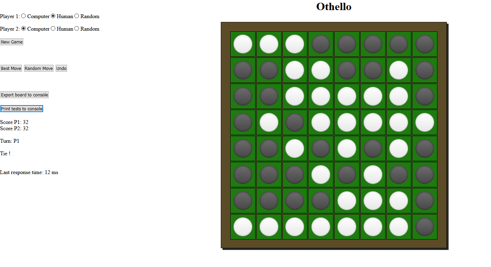

# Othello (PiS, SoSe 2020) 

Autor: Till Nitsche, 5197769

Ich habe die Zulassung für PiS im SoSe 2020 bei Herrn Herzberg erhalten.

# Inhaltsverzeichnis
1. [Einleitung](#einleitung)
    1. [Spielregeln](#spielregeln)
    <Noch TOC-Addon herunterladen...>

## Einleitung

### Spielregeln

Das Spiel Othello (nah verwandt mit Reversi) ist ein Spiel für 2 Spieler. 
Ein neues Spiel wird immer mit zwei Spielsteinen beider Farben in der Mitte, diagonal über Kreuz, gestartet.
Gezogen wird abwechselnd. 
Der Spieler muss mit jedem Zug einen seiner Steine auf dem Spielfeld so platzieren, dass dieser mit einem anderen Stein seiner eigenen Farbe einen gegnerischen "einschließt". 
Damit werden alle eingeschlossenen Steine umgedreht und erhalten die Farbe des ziehenden Spielers. 
Das Ziel besteht darin möglichst viele Spielsteine seiner eigenen Farbe zum Ende eines Spiels auf dem Feld zu haben.
Falls ein Spieler keinen Zug durchführen kann, ist der Gegner an der Reihe.
Sobald es keine gültigen Züge für beide Spieler mehr gibt, endet das Spiel (das Feld muss also nicht zwingend mit Steinen gefüllt sein).

### Bedienungsanleitung

Nach dem Start mit `gradle run` öffnet sich automatisch der Standard-Browser mit der im Programm hinterlegten URL.
Falls dies nicht funktionieren sollte, kann die Oberfläche auch über `http://localhost:7070/` erreicht werden.

Das Spiel startet mit dem voreingestellten Start-Spielbrett. 
Die Spieleinstellungen sind standardmäßig mit einem menschlichen Spieler als Player1 und einem Computer-Spieler als Player2. 
Diese Einstellungen können zu jeder Zeit angepasst werden, auch mitten im Spiel.

Optionen für Player1 und Player2:
 * ``Computer``: Macht immer einen perfekten Zug
 * ``Human``: Lässt den Benutzer einen gültigen Zug machen
 * ``Random``: Führt einen zufälligen Zug durch
 
 Mit ``New Game`` wird mit gegebenen Einstellungen ein neues Spielbrett generiert. 
 Falls ein Spieler der Rolle `Human` am Zug ist, besteht die Möglichkeit eine dieser Aktionen durchzuführen:
 * ``Best Move``: Ein perfekter Zug wird durchgeführt
 * ``Random Move``: Ein zufälliger Zug wird durchgeführt
 * ``Undo``: Ein Zug wird rückgängig gemacht

Die erforderlichen Tests für dieses Projekt können durch ``Print tests to console`` in der Konsole ausgegeben werden.

Bei der Durchführung von Tests der Game-Engine kann man sich das aktuell im Browser dargestellte Spielbrett mit `Export board to console` exportieren, um relativ einfach innerhalb der Anwendung eine Instanz dieses Spielfeldes erzeugen zu können.
Der String ist ein Triple-Objekt, wird in der Konsole ausgegeben und kann in der Testklasse eingefügt werden (näheres im Abschnitt TST).
 
 

### Dateiübersicht

    \build.gradle
    \README.md
    \screenshot.PNG
    \src\main\kotlin\othello\App.kt
    \src\main\kotlin\othello\Othello.kt
    \src\main\kotlin\othello\OthelloGame.kt
    \src\main\kotlin\othello\Test.kt
    \src\main\kotlin\othello\db.txt
    \src\main\resources\public\black-circle.png
    \src\main\resources\public\white-circle.png
    \src\main\resources\public\index.html
    \src\main\resources\public\style.css
    \src\main\resources\public\script.js

    -------------------------------------------------------------------------------
    Language                     files          blank        comment           code
    -------------------------------------------------------------------------------
    Kotlin                           4            139             51            389
    HTML                             1              9              3            134
    CSS                              1              4              0             67
    JavaScript                       1             15             11             35
    -------------------------------------------------------------------------------
    SUM:                             7            167             65            625
    -------------------------------------------------------------------------------
    
 
 

## Spiel-Engine (ENG)

Feature    | AB  | H+S | K  |  eD  | B+I+Im | Summe
-----------|-----|-----|-----|-----|------|----
Umsetzung  | 120 | 100 |  40 | 130 |  100 |
Gewichtung | 0.4 | 0.3 | 0.3 | 0.3 |  0.3 | 
Ergebnis   |  48 |  30 |  12 |  39 |   30 | **159%**

<Erläuterungen zur Ihrer Implementierung der Spiele-Engine>
 
 

## Tests (TST)

Szenario |  1  |  2  |  3  |  4  |  5  | Summe
---------|-----|-----|-----|-----|-----|-------
ok       |  X  |  X  |  X  |  X  |  -  | 0.8

Die Tests werden wie folgt ausgeführt:

Die Tests werden durch eine Request durch den Client im Browser ausgelöst. Dazu muss der Button ``Print tests to console`` angeklickt werden. 
Danach erscheinen die unten aufgeführten Tests auch in der Konsolenanwendung.

Um verschiedene Testszenarien zu simulieren, können die ``scenarios`` in der Klasse `Test.kt` angepasst werden.
Dort lassen sich im Kopf der Datei für die Szenarien Triple-Objekte, bestehend aus den Bitboards für Spieler 1, Spieler 2 und ziehendem Spieler (1/-1) anpassen.
Da diese sehr unleserlich sind und nur sehr mühsam nachzubilden sind, gibt es die Möglichkeit sich in der GUI passende Triple-Objekte für dargestellte Spielbretter ausgeben zu lassen.
Damit kann das folgende Programm sehr einfach Instanzen der verschiedenen Spielsituationen erzeugen. 

Anleitung zum Generieren eigener Testszenarien:
 1. Beliebige Spielsituation im Browser erzeugen
 2. Button ``Export board to console`` drücken
 3. Code-Snippet des Triple-Objekts kopieren
 4. In beliebiges Testszenario (`scenario1` - `scenario5`) einfügen
 5. Programm neu kompilieren und Testergebnis per GUI in der Konsole ausgeben lassen!

 
 

Die Testausführung protokolliert sich über die Konsole wie folgt:

    ----------- TEST MODE START -----------------------------------------------------------------------------------------
    
    Player1 = X                  Player2 = O
    
    
    Positive evaluation values are good for the current player, while negative values could lead to a loss
    ---------------------------------------------------------------------------------------------------------------------
    
    
    
    
    
    
    
    
    
    ###########################################################################
    #                           Test 1                                        #
    ###########################################################################
    
    
    ---------------------------------
    | X | X | X | X | X | O | X |  7|
    | X | X | X | O | O | O | O | O |
    | X | X | X | X | X | O | O | O |
    | X | X | X | X | O | O | X | O |
    | X | X | X | X | X | O | X | O |
    | O | O | O | X | X | O | X | O |
    | O | O | X | X | X | O | X | O |
    | O | O | O | O | O | O | 62| O |
    ---------------------------------
    
    ~~~~~~~~~~~~~~~~~~~~ EVALUATIONS ~~~~~~~~~~~~~~~~~~~~
    Position 7 = 0
    Position 62 = 3000
    
    ~~~~~~~~~~~~~~~~~~~~ BEST MOVE ~~~~~~~~~~~~~~~~~~~~
    at position 62
    
    ---------------------------------
    | X | X | X | X | X | O | X |  7|
    | X | X | X | O | O | O | O | O |
    | X | X | X | X | X | O | O | O |
    | X | X | X | X | O | O | X | O |
    | X | X | X | X | X | O | X | O |
    | O | O | O | X | X | O | X | O |
    | O | O | X | X | X | X | X | O |
    | O | O | O | O | O | O | X | O |
    ---------------------------------
    
    ~~~~~~~~~~~~~~~~~~~~ LEADS TO ~~~~~~~~~~~~~~~~~~~~
    Win for player1
    
    ---------------------------------
    | X | X | X | X | X | O | O | O |
    | X | X | X | O | O | O | O | O |
    | X | X | X | X | X | O | O | O |
    | X | X | X | X | O | O | X | O |
    | X | X | X | X | X | O | X | O |
    | O | O | O | X | X | O | X | O |
    | O | O | X | X | X | X | X | O |
    | O | O | O | O | O | O | X | O |
    ---------------------------------
    Score: (P1=33 | P2=31)
    
    
    
    
    
    ###########################################################################
    #                           Test 2                                        #
    ###########################################################################
    
    
    ---------------------------------
    | O | O | O | O | O | X | O | O |
    | X | O | O | O | O | X | O | X |
    | X | X | O | X | X | X | X | X |
    | 24| X | X | O | O | O | O | X |
    | O | X | O | O | O | O | O | X |
    | X | X | X | X | X | O | O | X |
    | O | O | O | X | O | X | X | X |
    | 56| O | 58| X | X | X | X | X |
    ---------------------------------
    
    ~~~~~~~~~~~~~~~~~~~~ EVALUATIONS ~~~~~~~~~~~~~~~~~~~~
    Position 24 = 2000
    Position 58 = 2000
    
    ~~~~~~~~~~~~~~~~~~~~ BEST MOVE ~~~~~~~~~~~~~~~~~~~~
    at position 24
    
    ---------------------------------
    | O | O | O | O | O | X | O | O |
    | X | O | O | O | O | X | O | X |
    | X | X | O | X | X | X | X | X |
    | 24| X | X | O | O | O | O | X |
    | O | X | O | O | O | O | O | X |
    | X | X | X | X | O | O | O | X |
    | O | O | O | O | O | X | X | X |
    | 56| O | O | X | X | X | X | X |
    ---------------------------------
    
    ~~~~~~~~~~~~~~~~~~~~ LEADS TO ~~~~~~~~~~~~~~~~~~~~
    Win for player1
    
    ---------------------------------
    | O | O | O | O | O | X | O | O |
    | X | O | O | O | O | X | O | X |
    | X | X | O | X | X | X | X | X |
    | X | X | X | O | O | O | O | X |
    | X | X | O | O | O | O | O | X |
    | X | X | X | X | O | O | O | X |
    | X | X | O | O | O | X | X | X |
    | X | X | X | X | X | X | X | X |
    ---------------------------------
    Score: (P1=36 | P2=28)
    
    
    
    
    
    ###########################################################################
    #                           Test 3                                        #
    ###########################################################################
    
    
    ---------------------------------
    | X | X | X |  3| O |  5| X | X |
    | X | O | X | 11| 12| O | X | X |
    | X | X | X | X | X | X | X | X |
    | O | O | X | X | X | X | O | X |
    | O | O | X | X | X | O | O | X |
    | X | O | X | O | X | O | O | O |
    | X | O | O | X | O | O | O | O |
    | X | O | O | O | O | O | O | O |
    ---------------------------------
    
    ~~~~~~~~~~~~~~~~~~~~ EVALUATIONS ~~~~~~~~~~~~~~~~~~~~
    Position 11 = 1000
    Position 12 = 1000
    
    ~~~~~~~~~~~~~~~~~~~~ BEST MOVE ~~~~~~~~~~~~~~~~~~~~
    at position 11
    
    ---------------------------------
    | X | X | X |  3| O |  5| X | X |
    | X | O | O | O | 12| O | X | X |
    | X | X | O | O | O | X | X | X |
    | O | O | X | O | X | O | O | X |
    | O | O | X | O | X | O | O | X |
    | X | O | X | O | X | O | O | O |
    | X | O | O | X | O | O | O | O |
    | X | O | O | O | O | O | O | O |
    ---------------------------------
    
    ~~~~~~~~~~~~~~~~~~~~ LEADS TO ~~~~~~~~~~~~~~~~~~~~
    Win for player1
    
    ---------------------------------
    | X | X | X | X | X | X | X | X |
    | X | O | X | X | O | X | X | X |
    | X | X | O | X | O | O | X | X |
    | O | O | X | X | X | O | O | X |
    | O | O | X | X | X | O | O | X |
    | X | O | X | X | X | O | O | O |
    | X | O | O | X | O | O | O | O |
    | X | O | O | O | O | O | O | O |
    ---------------------------------
    Score: (P1=34 | P2=30)
    
    
    
    
    
    ###########################################################################
    #                           Test 4                                        #
    ###########################################################################
    
    
    ---------------------------------
    | O | X | X | X | X | X | X | X |
    |  8| O | O | O | O | O | X | X |
    | O | O | O | O | X | X | O | X |
    | O | O | O | O | O | O | O | X |
    | O | O | O | O | O | O | O | X |
    | O | O | O | X | O | O | O | 47|
    | O | O | O | O | X | O | O | X |
    | O | O | O | O | O | O | O | O |
    ---------------------------------
    
    ~~~~~~~~~~~~~~~~~~~~ EVALUATIONS ~~~~~~~~~~~~~~~~~~~~
    Position 8 = -3000
    Position 47 = 0
    
    ~~~~~~~~~~~~~~~~~~~~ BEST MOVE ~~~~~~~~~~~~~~~~~~~~
    at position 47
    
    ---------------------------------
    | O | X | X | X | X | X | X | X |
    |  8| O | O | O | O | O | X | X |
    | O | O | O | O | X | X | O | X |
    | O | O | O | O | O | X | O | X |
    | O | O | O | O | O | O | X | X |
    | O | O | O | X | X | X | X | X |
    | O | O | O | O | X | O | O | X |
    | O | O | O | O | O | O | O | O |
    ---------------------------------
    
    ~~~~~~~~~~~~~~~~~~~~ LEADS TO ~~~~~~~~~~~~~~~~~~~~
    Tie
    
    ---------------------------------
    | O | X | X | X | X | X | X | X |
    | X | X | X | X | X | X | X | X |
    | O | X | O | O | X | X | O | X |
    | O | O | X | O | O | X | O | X |
    | O | O | O | X | O | O | X | X |
    | O | O | O | X | X | X | X | X |
    | O | O | O | O | X | O | O | X |
    | O | O | O | O | O | O | O | O |
    ---------------------------------
    Score: (P1=32 | P2=32)
 
 

## Umsetzung der GUI

### HTML

Das Spielbrett als Herzstück wird als ein simples ``table`` dargestellt. 
Besonders ist, dass diese Tabelle niemals vom Client geändert wird, sondern mit jeder Änderung am Spielbrett komplett neu übertragen wird.
Diese Tabelle wird mithilfe einer Methode der ``Othello-Klasse`` jedes Mal neu zusammengestellt. 

Bei den Feldern einer Tabelle wird unterschieden zwischen:
* ``square``: Leeres Feld
* ``whiteSquare/blackSquare``: Besetztes Feld
* ``whiteSuggSquare/blackSuggSquare``: Gültiger nächster Zug

### CSS

Die Felder werden nicht umsonst in drei Kategorien eingeteilt; mithilfe von CSS bekommen diese nämlich verschiedene Eigenschaften.
``square`` wird als leeres Feld in der richtigen Größe und ohne Events dargestellt.
`whiteSquare/blackSquare` hingegen erhalten dieselben Eigenschaften plus den Link zu dem Bild des Spielsteins ihrer Farbe (`white-circle.png / black-circle.png`).
``whiteSuggSquare/blackSuggSquare`` sehen aus wie ein `square`, nur erhalten noch zusätzlich ein Mouse-Hover-Event, bei dem das entsprechende Bild dargestellt wird.
 
### Javascript

#### Kommunikation
Am Anfang habe ich immer nur das aktuelle Spielfeld als ``table`` in der Antwort auf ein GET gesendet.
Der erhaltene String wird einfach nur in das innerHTML eines ``div`` geschrieben, um dadurch das Board zu aktualisieren.
Nun gibt es allerdings noch mehr Informationen über den aktuellen Spielzustand, den ich gerne übermitteln würde wie
z.B. wer gerade am Zug ist, was der aktuelle Score ist oder ob jemand gewonnen hat. Dazu kam mir folgende Idee:

 
Ich sende alle Informationen in einem String, allerdings mit System. Eine Nachricht sollte so aufgebaut sein:

    boardAsHTML###turn###scorePlayer1###scorePlayer2###result

Das könnte in einem (verkürzten Beispiel) so aussehen:

    <table>...</table>###-1###23###41###0
    
 
Jede Information wird mit der Zeichenfolge ### von den übrigen getrennt. 
Diese lassen sich dann kinderleicht mit einem Split in Javascript auf ein Array aufteilen. 
Da alle Informationen immer an derselben Stelle stehen, können diese gewissenhaft ausgelesen und an die verschiedenen Stellen im HTML-Dokument zur Darstellung delegiert werden.

#### Automatische Züge
Es ist möglich eine Schleife von Requests auszulösen, indem man zwei "automatische Spieler" gegeneinander spielen lässt.
Nach Auswahl von bspw. Player1 als ``Computer`` und Player2 als`Random` wird das Spiel bis zum bitteren Ende gespielt.
Das liegt daran, dass nach jeder Request ein Check erfolgt, ob der aktuell spielende Spieler einer von den beiden genannten ist.
Ist das der Fall, so geht eine erneute Anfrage heraus.
Da besonders zufällige Spielzüge eigentlich nur wenige Millisekunden benötigen, wurde eine künstliche Verzögerung mit Javascript zwischen jeder Request eingebaut.
Damit lässt sich das Spielgeschehen auch als "normaler" Spieler ganz gut nachverfolgen. 
Möchte man ein Duell zwischen zwei virtuellen Gegnern pausieren, so kann man beispielsweise einen Spieler zeitweise auf ``Human`` stellen.

#### Interaktion während automatischen Zügen
Um "dumme" Benutzereingaben während einem automatischen Zug durch `Computer` oder `Random` abzuwehren,
wird für die Dauer eines Requests die Tabelle und alle weiteren Interaktionsfelder gesperrt. 
Das geschieht mithilfe der CSS-Property ``.style.pointerEvents="none"``. Sobald ein Request eintrifft, wird diese wieder auf `.style.pointerEvents="all"` gesetzt.

#### Zeitmessung
Zum Messen der Berechnungsdauer wird die Antwortzeit aus Sicht des Clients genommen. 
Genau genommen ist das die Zeitspanne zwischen Absenden der Request mit GET und dem Eintreffen einer Response-Nachricht.
Mithilfe von zwei Variablen, die die Timestamps verwalten, kann dann im Dokument die benötigte Zeit angegeben werden (``start - end``).

 
 

## Hinweise

* Die dargestellte Antwortzeit funktioniert korrekt, die Darstellung wird lediglich immer künstlich um eine gewisse Zeitspanne verzögert, damit ein generierter Spielzug besser für den Benutzer nachvollziehbar ist. 
* Die Testfälle sind nicht so einfach zu erstellen, da sich das Spielfeld immer dynamisch ändert und ein Zug in mehreren Tiefen für uns Menschen schwer bis unmöglich vorstellbar ist. 
  Eine Darstellung des gesamten Baums ist leider sehr unübersichtlich, weshalb ich mich dagegen entschieden habe, jeden einzelnen Zug darzustellen. 

 
 

## Quellennachweis

* [Othello-Heuristiken](http://home.datacomm.ch/t_wolf/tw/misc/reversi/html/index.html)
* [Heuristik-Implementierung](https://github.com/kartikkukreja/blog-codes/blob/master/src/Heuristic%20Function%20for%20Reversi%20(Othello).cpp)
* [Bitboard - Rotationen und Spiegelungen](https://www.chessprogramming.org/Flipping_Mirroring_and_Rotating)
* [Spielfeld mit HTML und CSS](https://www.youtube.com/watch?v=Z_IaJQojun8&t=253s)
* [Alpha-Beta, Negamax, Zugsortierung](https://de.wikipedia.org/wiki/Alpha-Beta-Suche)